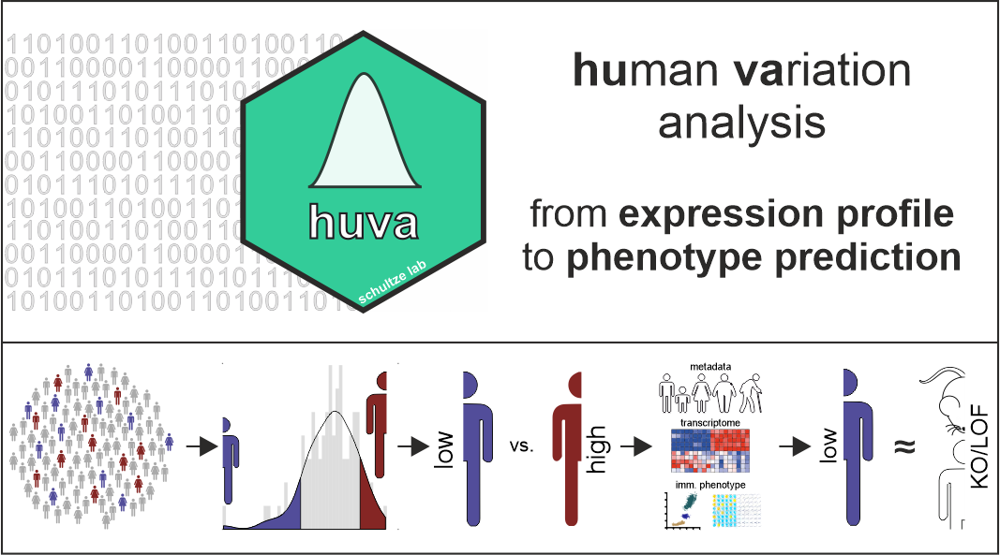

# *huva*: *hu*man *va*riation in gene expression as surrogate for gene function 
### *Lorenzo Bonaguro, Jonas Schulte-Schrepping, Caterina Carraro, Laura Sun, Benedikt Reiz, Ioanna Gemünd, Adem Saglam, Leo A. B. Joosten, Frank L. van de Veerdonk, Mihai G. Netea, Kristian Händler, Thomas Ulas, Joachim L. Schultze, Anna C. Aschenbrenner*



## Abstract
In the last decades, the spread of increasingly affordable transcriptomic techniques and the concomitant production of population-scale multi-layered datasets assembled extensive experimental data of different types on single healthy individuals. Within this population, most genetic variation and environmental factors are influencing gene expression with no clinical evidence of pathological states. Variance of gene expression, which is a characteristic of any given natural population, can be exploited to set up a conditional quasi loss- and gain-of-function “in population” experiment if expression values for the gene of interest (GOI) are available in a sufficiently large cohort. We describe here a novel tool, called *huva* (human variation), which takes advantage of population-scale multi-layer data to infer gene function and relationship between phenotype and gene expression. Within a reference dataset, *huva* derives two experimental groups, i.e. individuals with LOW or HIGH expression of the GOI, enabling the subsequent comparison of their transcriptional profile and functional parameters. We demonstrate that this approach robustly and efficiently identifies the phenotypic relevance of a GOI, allowing the stratification of genes according to shared functions. Additionally, we describe how *huva* can predict the phenotype of naturally occurring gain-of-function mutations in humans, further validating the biological power of the approach.

## Why this repository?
This repository provides the original code used to prepared each pannel of the manuscript, to ensure the reproducbility of the analysis we provide a docker image for and Rstudio session including all required dependencies and the *huva* package (v. 0.1.4).

## How to use this repository
We try to provide acces to the analisis in the easiet possible way, the user can follow this few intruction and should be able to be up and running. Withing each folder you can find all the scripts and data required the reproduce the analysis. Just open the 'Figure_X.Rmd' and run it.  

### Requirements
Some of the calculations, expecially to reproduce figure 3 can be quite memory demanding, we sugges a minimum of 32 Gb of system memory.
- [Git](https://git-scm.com/)
- [Docker](https://www.docker.com/)

### Cloning the repository
```sh
# Make a local copy of the repository
git clone link.gitlab

# Navigate to the folder
cd huva_reproducibility
```
### Build the Docker image and start the container
```sh
# Build the Docker image
docker build -t reproduce .

# Run a container
docker run -dp 8787:8787 -e USER=mariorossi -e PASSWORD=mariorossi --name rep_huva -v 'your_directory':/data/ reproduce
```
### Open the RStudio session
Enter in your browser `localhost:8787`, this should start a Rstudio session you can use to explore the code and reproduce the analysis.

## How to cite *huva*
If you use *huva* in your research project consider citing us [linktojournal](weblink).

## Contact or follow us
For any problem of question regrding the *huva* package or this repositoy or you just want to be up to date on what is coming next, send us an [email](mailto:lorenzobonaguro@uni-bonn.de) or follow us:  

  

[@LorenzoBonaguro](https://twitter.com/LorenzoBonaguro)  
[@AschenbrennerAC](https://twitter.com/AschenbrennerAC)  
[@LabSchultze](https://twitter.com/LabSchultze)